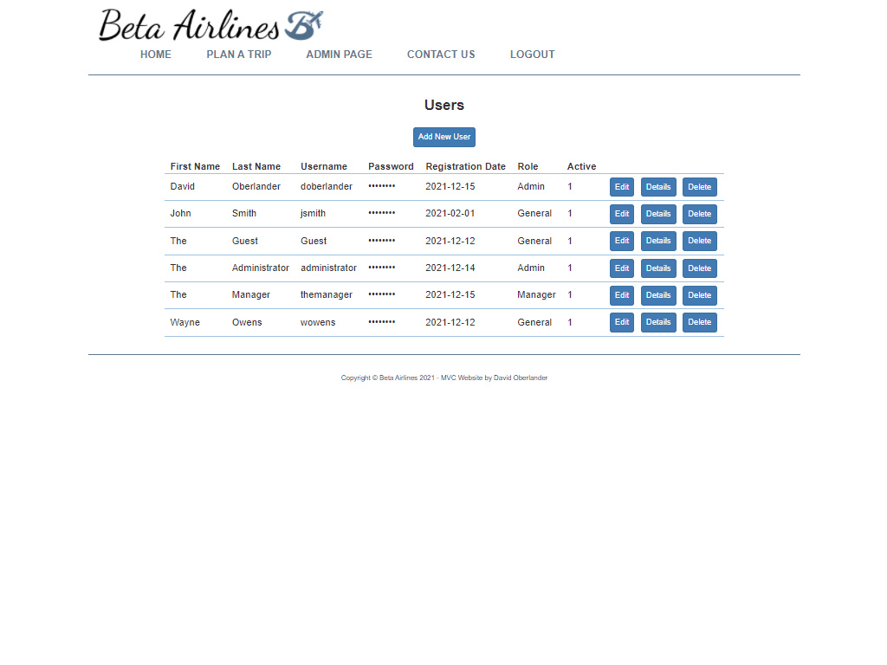

<h1>Beta Airlines</h1>
This website was created with ASP.NET MVC using C#.  
This connects to a Microsoft SQL database that stores the user, flight, and message data. 
There are 3 separate user access roles, applying the appropriate restrictions for each. (General, Manager, and Admin) 
The administrator would have the ability to add more roles and have full access to setting up flights, airports, users, etc. 
The manager has limited administrative privileges, but are able to manage users and messages that come in through the contact form.  
Users with General access are limited to just being able to book a flight and see their own flights that they have booked already.  
<h2>Some Screenshots</h2>
<h3>Home</h3>

<h3>Plan A Trip</h3>

<h3>Book A Flight (Login Page)</h3>

<h3>Admin Page</h3>

<h3>Admin Page: Users</h3>

<h3>Admin Page: Flights</h3>

<h3>General User Page: Book A Flight</h3>

<h3>General User Page: Booked Flights</h3>

<h3>Manager Page</h3>

<h3>Contact Us Form</h3>

